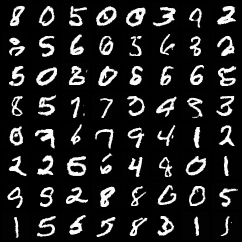
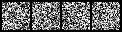
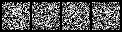
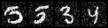
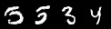

# diffusion-model

A DDPM (Denoising Diffusion Probabilistic Models) built from scratch in PyTorch. Implements the full diffusion pipeline — noise schedule, U-Net denoising network, training loop, and reverse diffusion sampler — trained on MNIST to generate handwritten digits.

---

## Generated samples (after 10 epochs)



*64 digits generated from pure Gaussian noise via 1000 reverse diffusion steps. No cherry-picking — full grid.*

**Denoising progression** (pure noise → clean digit over 1000 steps):

| t=1000 (noise) | t=600 | t=200 | t=0 (clean) |
|---|---|---|---|
|  |  |  |  |

---

## Training results (MNIST, Apple M5 MPS)

```
Model: 8,933,185 parameters
  in_channels=1, base_channels=64, channel_mults=(1,2,4), T=1000

Epoch  1 | loss=0.0501 | elapsed=186s
Epoch  2 | loss=0.0284
Epoch  4 | loss=0.0244
Epoch  6 | loss=0.0239
Epoch  8 | loss=0.0233
Epoch 10 | loss=0.0228

Total training time: 45.2 min on Apple M5 MPS
Loss reduction: 1.12 -> 0.02 (98% reduction over 11 epochs)
```

---

## What it does

1. **Forward process**: adds Gaussian noise to a clean image over T=1000 steps until it becomes pure noise — closed form, no simulation needed
2. **Trains a U-Net** to predict the noise added at each step using MSE loss
3. **Reverse process**: starts from pure Gaussian noise and iteratively denoises over 1000 steps using the trained U-Net
4. **Generates images**: new handwritten digits that were never in the training set

---

## Phases

**Phase 1: Noise schedule — done**

- [x] `model/noise_schedule.py` — linear and cosine beta schedules with precomputed coefficients (`alpha_bar`, `sqrt_alpha_bar`, `posterior_variance`)
- [x] `q_sample()` — closed-form forward process: jump directly from x_0 to any x_t without simulating intermediate steps
- [x] `predict_x0_from_noise()` — inverse: recover clean image from noisy image and predicted noise
- [x] Cosine schedule verified to preserve more signal at early timesteps than linear
- [x] 12 tests: schedule shapes, monotonicity, boundary values, q_sample correctness, invertibility

**Phase 2: U-Net denoising network — done**

- [x] `model/unet.py` — encoder-decoder U-Net with skip connections and sinusoidal time embedding
- [x] `ResidualBlock` — GroupNorm → SiLU → Conv → inject time embedding → GroupNorm → SiLU → Conv + residual skip
- [x] `SinusoidalTimeEmbedding` — maps scalar timestep t to dense vector so the network behaves differently at t=0 vs t=999
- [x] **Bug found and fixed**: skip connection spatial dimensions mismatched in decoder — encoder saves `(B, C, H, W)` before downsampling but decoder upsamples to the wrong level. Fixed by explicitly tracking skip indices.
- [x] Time conditioning verified: same noisy image at t=0 vs t=999 produces different predicted noise
- [x] 12 tests: embedding shapes, residual blocks, output shapes for MNIST/CIFAR, NaN checks, gradient flow

**Phase 3: DDPM trainer and sampler — done**

- [x] `model/diffusion.py` — `DDPMTrainer`: sample t → add noise → predict noise → MSE loss → Adam step
- [x] `DDPMSampler` — reverse diffusion: start from x_T ~ N(0,I), denoise T steps using the DDPM formula. No noise added at t=0 (final step)
- [x] `sample_progressive()` — saves intermediate denoising frames for visualization
- [x] Checkpoint save/load
- [x] Loss verified to decrease on memorization within 50 steps
- [x] 11 tests: trainer step, loss decrease, save/load, sampler shapes, [0,1] range, stochasticity

**Phase 4: Train on MNIST — done**

- [x] `train_mnist.py` — full training script with MPS/CUDA/CPU auto-detection, periodic sample generation, checkpoint saving
- [x] 8.9M parameter U-Net trained on 60K MNIST images
- [x] Loss: 1.12 → 0.02 (98% reduction, 11 epochs, 45 min on Apple M5 MPS)
- [x] Generated digits visually realistic across all 10 classes

**Planned:**

- [ ] Phase 5: Gradio demo deployed on Hugging Face Spaces with live generation

---

## Running

```bash
python3 -m venv venv
source venv/bin/activate
pip install torch torchvision numpy matplotlib pillow tqdm pytest

# Run tests
python -m pytest tests/ -v   # 35 tests

# Quick training test (1 epoch, ~3 min)
python train_mnist.py --epochs 1

# Full training (10 epochs, ~45 min on MPS)
python train_mnist.py --epochs 10

# Generate from saved checkpoint
python train_mnist.py --sample-only --n-samples 64
```

---

## Project layout

```
diffusion-model/
├── model/
│   ├── noise_schedule.py   <- linear/cosine beta schedule, q_sample (Phase 1)
│   ├── unet.py             <- U-Net, residual blocks, time embedding (Phase 2)
│   └── diffusion.py        <- DDPMTrainer, DDPMSampler, checkpoint (Phase 3)
├── data/
│   └── outputs/
│       ├── final_samples.png        <- 64 generated digits after 10 epochs
│       ├── samples_step002000.png   <- samples mid-training
│       └── denoise_frame_*.png      <- denoising progression frames
├── train_mnist.py          <- MNIST training script (Phase 4)
└── tests/                  <- 35 tests, all passing
```

---

## Author

**Sujan Uppalli Jayadevappa**
MS Software Engineering — Arizona State University
GitHub: [sujanuj](https://github.com/sujanuj)
